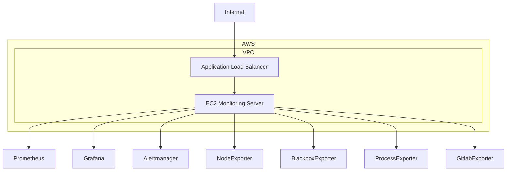

# 📊 Monitoring Stack (Terraform + Ansible)


Projeto para provisionar e configurar uma stack completa de monitoramento utilizando **Terraform** para infraestrutura na AWS e **Ansible** para configuração dos serviços.

---

## 🏗️ Arquitetura



📁 Estrutura do Projeto

---

```
.
├── monitoring_ansible
│ ├── hosts
│ ├── main.yml
│ └── roles
│ ├── alertmanager
│ ├── blackbox
│ ├── gitlab-ci-pipelines-exporter
│ ├── grafana
│ ├── grafana_plugins
│ ├── node
│ ├── process_exporter
│ └── prometheus
│
└── monitoring_tf
├── load_balancer.tf
├── main.tf
├── monitoring.tf
├── monitoring.tfvars
├── outputs.tf
├── security_rules.tf
├── variables.tf
└── vpc.tf
⚙️ Tecnologias
Terraform
```

# AWS

1. VPC
2. EC2
3. Load Balancer
4. Security Groups

# Automação

1. Ansible

# Ferramentas de monitoramento e métricas

1. Prometheus
2. Grafana
3. Alertmanager
4. Exporters

---

📋 Pré-requisitos

1. AWS CLI configurado
2. Terraform >= 1.x
3. Ansible >= 2.10
4. Chave SSH válida
5. Conta AWS

🚀 Deploy da Infraestrutura (Terraform)
cd monitoring_tf
terraform init
terraform apply -var-file=monitoring.tfvars
Após o apply:

IP público da instância será exibido

DNS do Load Balancer será exibido

⚙️ Configuração dos Serviços (Ansible)
Editar o arquivo hosts:

[monitoring]
X.X.X.X ansible_user=ec2-user ansible_ssh_private_key_file=~/.ssh/monitoring.pem
Executar:

cd monitoring_ansible
ansible-playbook -i hosts main.yml
🌐 Acessos
Grafana:
http://<ALB_DNS>:3000

Prometheus:
http://<ALB_DNS>:9090

🔐 Segurança
Acesso via Security Groups

Serviços expostos somente pelas portas necessárias

Load Balancer configurado como interno (ajustável via variável)

🧹 Destroy
cd monitoring_tf
terraform destroy -var-file=monitoring.tfvars
📌 Observações
Configurações dos serviços ficam em:

roles/\*/files

roles/\*/templates

Plugins do Grafana são instalados automaticamente via role.

👨‍💻 Autor
Projeto de estudo e automação de infraestrutura para monitoramento utilizando Infrastructure as Code.

```

```
