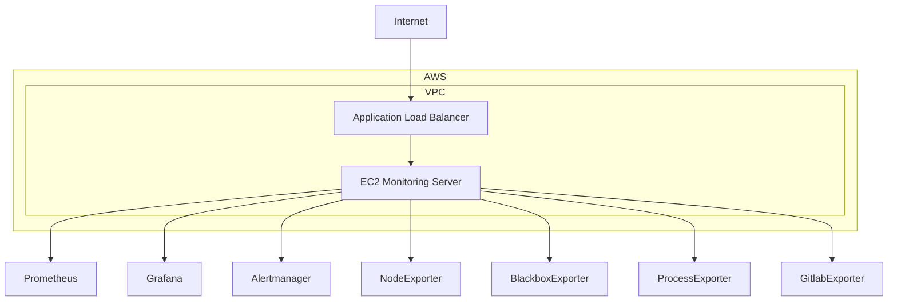

# 📊 Monitoring Stack (Terraform + Ansible)


Projeto para provisionar e configurar uma stack completa de monitoramento utilizando **Terraform** para infraestrutura na AWS e **Ansible** para configuração dos serviços.

---

## 🏗️ Arquitetura



📁 Estrutura do Projeto

---

```
.
├── monitoring_ansible
│ ├── hosts
│ ├── main.yml
│ └── roles
│ ├── alertmanager
│ ├── blackbox
│ ├── gitlab-ci-pipelines-exporter
│ ├── grafana
│ ├── grafana_plugins
│ ├── node
│ ├── process_exporter
│ └── prometheus
│
└── monitoring_tf
├── load_balancer.tf
├── main.tf
├── monitoring.tf
├── monitoring.tfvars
├── outputs.tf
├── security_rules.tf
├── variables.tf
└── vpc.tf
⚙️ Tecnologias
Terraform
```

☁️ Infraestrutura na AWS
VPC (Virtual Private Cloud)

EC2 (Elastic Compute Cloud)

Application Load Balancer

Security Groups

🤖 Serviços de Automação
Ansible (Provisionamento e Configuração)

🖥️ Serviços de Monitoramento e Observabilidade
Prometheus (Coleta de métricas)

Grafana (Visualização de dados)

Alertmanager (Gestão de alertas)

Node/Process Exporters (Exportação de métricas)

📋 Pré-requisitos

AWS CLI devidamente configurado

Terraform >= 1.x

Ansible >= 2.10

Par de Chaves SSH (arquivo .pem)

Conta AWS com permissões administrativas

🚀 Provisionamento da Infraestrutura (Terraform)

```
cd monitoring_tf
terraform init
terraform apply -var-file=monitoring.tfvars
```

Saídas esperadas após o deploy:

IP Público: Endereço da instância para acesso administrativo.

DNS do Load Balancer: Endpoint para acesso aos serviços de monitoramento.

⚙️ Configuração e Deploy de Serviços (Ansible)

Primeiro, atualize o inventário no arquivo hosts:

Ini, TOML
[monitoring]
X.X.X.X ansible_user=ec2-user ansible_ssh_private_key_file=~/.ssh/monitoring.pem
Em seguida, execute o Playbook:

Bash
cd monitoring_ansible
ansible-playbook -i hosts main.yml
🌐 Acessos e Endpoints

Grafana: http://<ALB_DNS>:3000

Prometheus: http://<ALB_DNS>:9090

🔐 Segurança e Boas Práticas

Controle de tráfego restrito via Security Groups.

Princípio do privilégio mínimo: apenas portas essenciais estão expostas.

Load Balancer: Configurado como interno por padrão (pode ser alterado para público via variáveis do Terraform).

🧹 Limpeza de Recursos (Destroy)

Bash
cd monitoring_tf
terraform destroy -var-file=monitoring.tfvars
📌 Estrutura de Arquivos

As configurações customizadas dos serviços estão localizadas em:

roles/\*/files: Arquivos estáticos e binários.

roles/\*/templates: Arquivos de configuração dinâmicos (Jinja2).

Nota: Os plugins do Grafana e dashboards base são provisionados automaticamente durante a execução da Role.

👨‍💻 Sobre o Projeto
Iniciativa focada no estudo de Infrastructure as Code (IaC) e automação de ambientes escaláveis para monitoramento.
